<div align="center">
  

  <h3>Differentiable circuit simulation in JAX</h3>

  <p>
    <a href="https://pypi.org/project/voltax/"></a>
    <a href="https://github.com/jaivardhankapoor/voltax/actions/workflows/ci.yml"></a>
    <a href="https://voltax.jkapoor.me/"></a>
    
    <a href="https://github.com/jax-ml/jax"></a>
    <a href="https://github.com/astral-sh/uv"></a>
    <a href="https://github.com/astral-sh/ruff"></a>
    <a href="LICENSE"></a>
  </p>

  <p>
    <a href="#quickstart">Quickstart</a> ·
    <a href="#gallery">Gallery</a> ·
    <a href="#accuracy-and-speed">Accuracy &amp; speed</a> ·
    <a href="#features">Features</a> ·
    <a href="https://voltax.jkapoor.me/">Docs</a>
  </p>
</div>

---

Voltax is a SPICE-style circuit simulator (DC, transient and AC analysis)
written in JAX, so you can take gradients through a simulation. You describe
a circuit in Python or load a SPICE netlist, measure something from the
result, such as a delay, the energy used or how well it fits data, and
`jax.grad` gives you its derivative with respect to every component value
and transistor parameter.

The gradients are computed with the adjoint method, so one gradient costs
about as much as one or two extra simulations, however many parameters there
are. Results agree with ngspice to about 1e-8 when both solve the same
equations, and BSIM4, compiled from its Verilog-A source, agrees with
ngspice's own implementation to about 1e-14. A sparse solver handles circuits
with ten thousand or more unknowns in milliseconds.

It is meant for fitting device models to measurements, Bayesian inference
over circuit parameters, optimizing designs against specs, and training
analog hardware. The examples below cover each of these.

## Quickstart

```bash
uv add voltax                  # or: uv pip install voltax
```

A three-stage inverter chain from a netlist, its propagation delay, and the
gradient of that delay with respect to each transistor's width:

```python
import jax
import jax.numpy as jnp
import voltax as vx

chain = vx.parse_netlist("""
.subckt inv in out vdd
M1 out in vdd vdd pmos w=2u l=0.13u
M2 out in 0   0   nmos w=1u l=0.13u
Cl out 0 5f
.ends
Vdd vdd 0 1.2
Vin in  0 PULSE(0 1.2 0.2n 20p 20p 2n 4n)
X1 in a vdd inv
X2 a  b vdd inv
X3 b out vdd inv
""")
t = jnp.linspace(0, 1e-9, 1001)

def delay(circuit):
    sol = vx.transient(circuit, t)
    return vx.measure.delay(t, sol.v("in"), sol.v("out"), 0.6, targ_direction="fall")

print(f"{delay(chain) * 1e12:.1f} ps")          # 43.5 ps
grads = jax.grad(delay)(chain)                  # a pytree shaped like the circuit
print(grads.elements["EKVMOSFET_n"].log_w)      # d delay / d log W, one per NMOS
```

The same circuit can be built in Python:

```python
b = vx.CircuitBuilder()
b.vsource("in", "0", vx.signals.Step(0.0, 1.0, delay=1e-6, rise=1e-9))
b.resistor("in", "out", 1e3, name="R1")
b.capacitor("out", "0", 1e-9, name="C1")
rc = b.build()

v_end = lambda r: vx.transient(rc.set("R1", r=r), t * 5e3).v("out")[-1]
jax.grad(v_end)(1e3)                            # dV/dR through a transient
```

## Gallery

Each figure is produced by a script in [`examples/`](examples/README.md)
(set `VOLTAX_FAST=1` for a one-minute run).

<table>
<tr><td colspan="2"><b>Fit and infer</b></td></tr>
<tr><td width="50%" valign="top"><a href="examples/01_rc_fitting.py">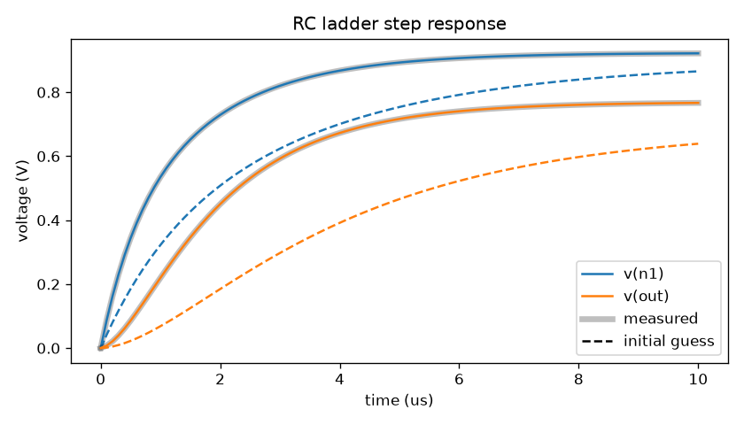</a><br><sub><b>RC fitting.</b> Recover R and C from step responses, and see why one probe is not enough to identify them.</sub></td><td width="50%" valign="top"><a href="examples/13_battery_ecm.py">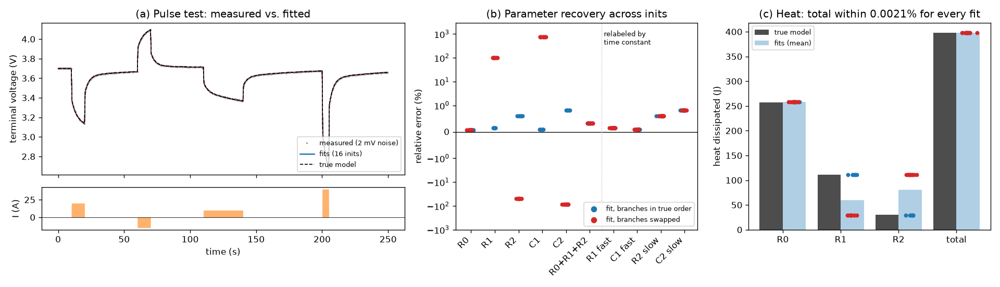</a><br><sub><b>Battery model.</b> Fit a two-RC equivalent circuit to a pulse test from 16 random starts; every fit predicts the heat to &lt;0.01%.</sub></td></tr>
<tr><td width="50%" valign="top"><a href="examples/08_ring_osc_inference.py">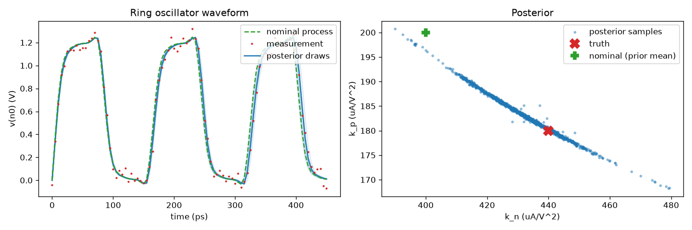</a><br><sub><b>Bayesian process extraction.</b> NUTS posterior over NMOS/PMOS process parameters from one noisy ring-oscillator waveform.</sub></td><td width="50%" valign="top"><a href="examples/09_rc_smc_inference.py">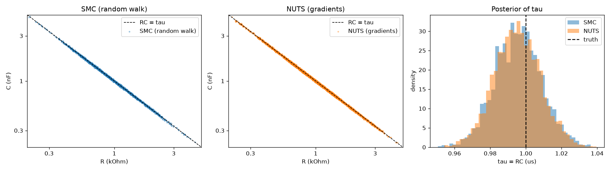</a><br><sub><b>SMC vs NUTS.</b> Gradient-free tempered SMC against NUTS on a ridge-shaped posterior.</sub></td></tr>
<tr><td colspan="2"><b>Design against specs</b></td></tr>
<tr><td width="50%" valign="top"><a href="examples/12_energy_delay_optimization.py">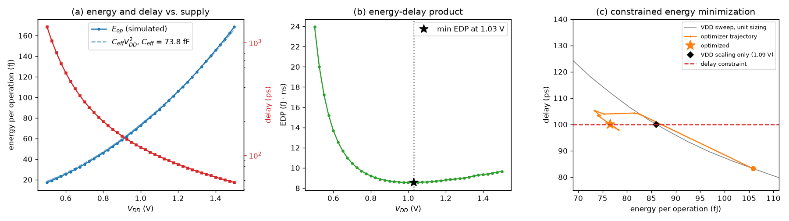</a><br><sub><b>Energy–delay co-design.</b> Minimize energy per operation under a delay constraint, over VDD and every stage width.</sub></td><td width="50%" valign="top"><a href="examples/05_power_grid_opt.py">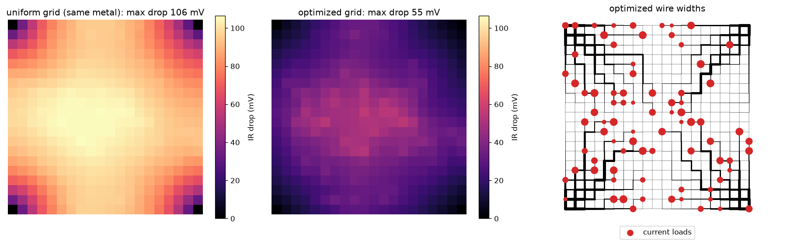</a><br><sub><b>Power-grid sizing.</b> 760 wire widths optimized against IR drop; adjoint gradient checked against finite differences.</sub></td></tr>
<tr><td width="50%" valign="top"><a href="examples/03_opamp_filter_design.py">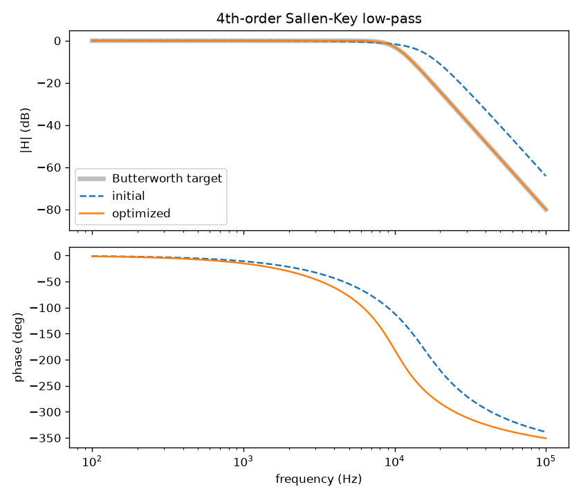</a><br><sub><b>Active filter design.</b> A 4th-order Sallen-Key tuned to a Butterworth response with finite op-amp bandwidth.</sub></td><td width="50%" valign="top"><a href="examples/02_netlist_cmos_inverter.py">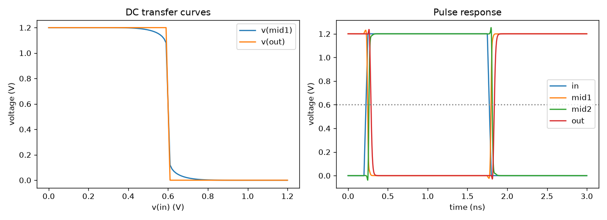</a><br><sub><b>From a netlist.</b> Transfer curves, pulse response and the gradient of delay w.r.t. every width of a SPICE deck.</sub></td></tr>
<tr><td colspan="2"><b>Search, learn and extend</b></td></tr>
<tr><td width="50%" valign="top"><a href="examples/07_logic_design_space.py">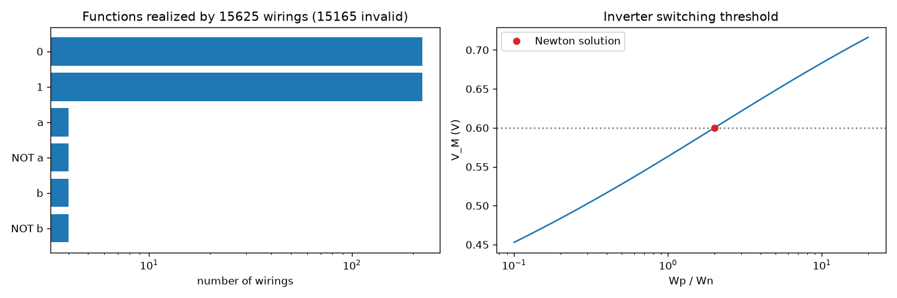</a><br><sub><b>Logic design space.</b> All 15,625 two-transistor wirings in one <code>vmap</code>; the inverter and the transmission gate show up among them.</sub></td><td width="50%" valign="top"><a href="examples/06_topology_discovery.py">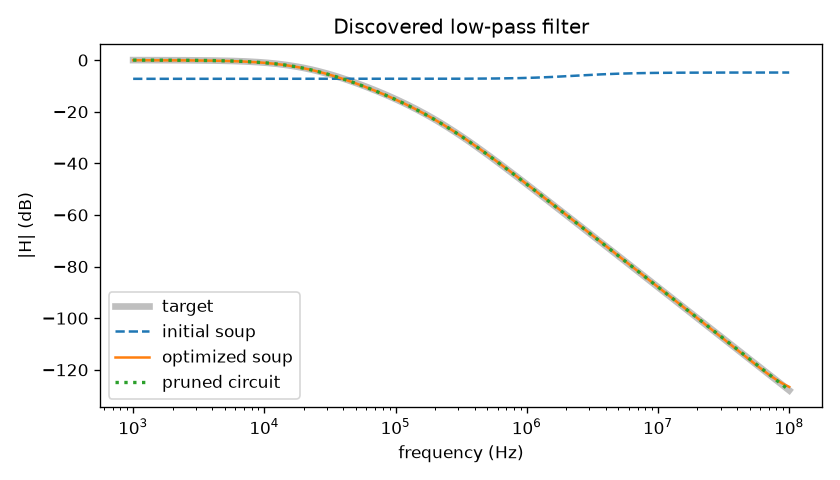</a><br><sub><b>Topology discovery.</b> A sparsity penalty prunes an all-to-all R+C soup down to an RC ladder.</sub></td></tr>
<tr><td width="50%" valign="top"><a href="examples/10_custom_element.py">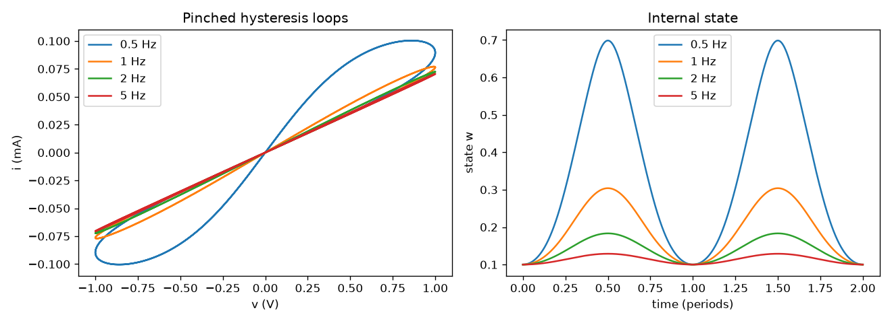</a><br><sub><b>Your own device.</b> A memristor written in about 30 lines, with its hysteresis loops and parameter gradients.</sub></td><td width="50%" valign="top"><a href="examples/04_adder_4bit.py">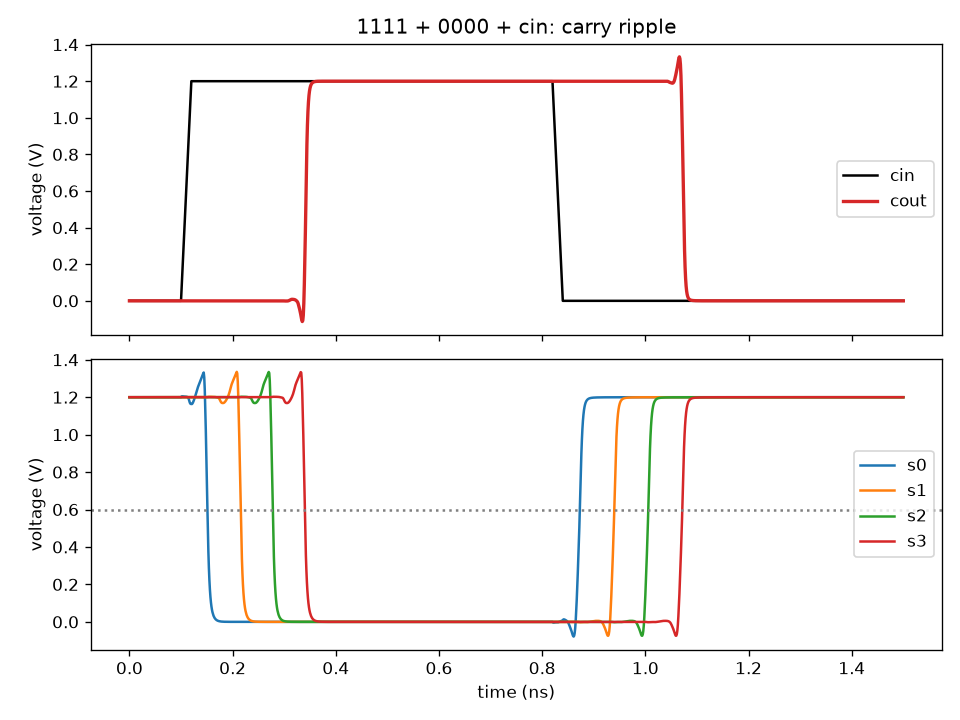</a><br><sub><b>4-bit adder.</b> 200 transistors from library gates; the carry ripples at ~63 ps per bit.</sub></td></tr>
<tr><td colspan="2"><b>Analog machine learning</b></td></tr>
<tr><td colspan="2" valign="top"><a href="examples/11_mnist_analog_cnn.py">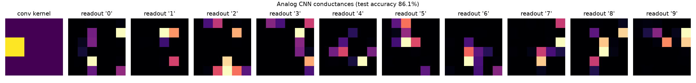</a><br><sub><b>Analog CNN.</b> A resistor–diode convolutional network trained with the circuit physics in the loop, then re-checked with E96 resistor values.</sub></td></tr>
</table>

## Accuracy and speed

Agreement with ngspice-42 on matched equations and time grids (maximum relative error):

| Circuit | Error |
|---|---|
| Resistive power grid DC, 1,600 nodes | 7.8e-11 |
| Five-transistor OTA: DC / transient / AC gain | 3.9e-9 / 2.1e-8 / 1.0e-5 |
| CMOS inverter chain, Level 1 | 5.2e-9 |
| Ring oscillator, 51 stages, 26 periods | 1.8e-7 |
| BSIM4 4.8: drain current / g<sub>m</sub>, g<sub>ds</sub> / capacitances | 7e-14 / 5e-14 / 7e-13 |
| sky130 inverter on BSIM4, v(out) at V<sub>DD</sub>/2 | 0.498914 V (ngspice: 0.498914 V) |

The ~1e-8 floor is the default 1e-12 S node-to-ground conductance; without it
an RC transient agrees to 5e-15.

<p align="center">
  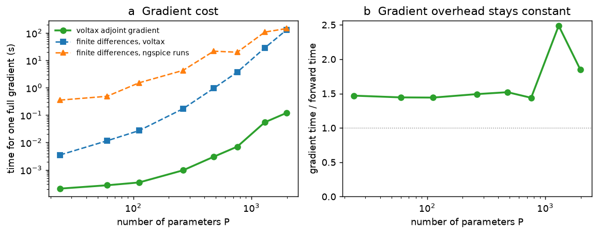
  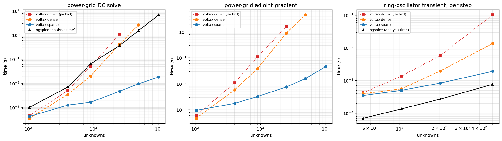
  <br><sub><b>Left:</b> gradient cost stays at 1.4–2.5× one simulation as parameters grow; at 1,984 parameters, 0.12 s against 129 s for finite differences.
  <b>Right:</b> the sparse solver scales linearly; ngspice grows as S<sup>2.1</sup> and dense LU as S<sup>2.7</sup>.</sub>
</p>
<p align="center">
  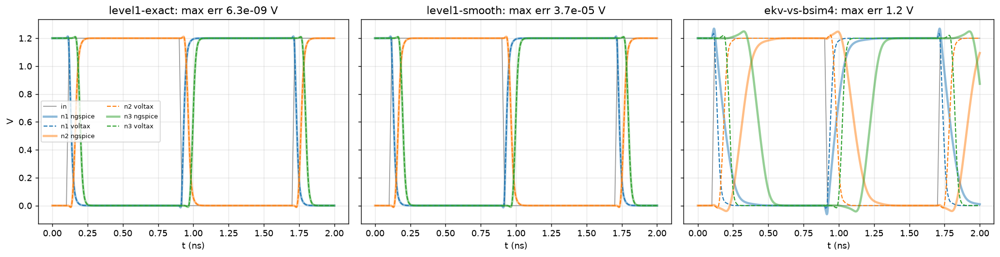
  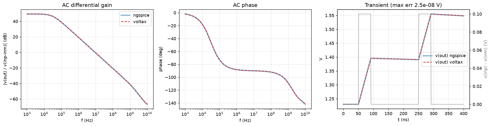
  <br><sub>Point-by-point against ngspice: an inverter chain (exact and smoothed Level 1, EKV vs BSIM4) and an OTA (AC gain, phase, transient).</sub>
</p>

Scripts and full tables: [`benchmarks/`](benchmarks/README.md).

## Industry compact models

`voltax.va` compiles Verilog-A into native, vectorized, differentiable devices.
BSIM4 4.8 matches ngspice's C implementation to 1e-14 and runs the published
sky130 and gf180mcu decks:

```python
inv = vx.parse_netlist(pdk_deck, models=vx.va.ngspice_bsim4_models())
```

The BSIM4 source is licensed CC BY-NC 4.0, so it is not distributed here:
`vx.va.load("bsim4")` downloads it on first use from a pinned commit and checks
its SHA-256. Gradients are only meaningful where a model is smooth, so the
compiler can also audit where it is not. For BSIM4 it finds no NaNs in values or second
derivatives, and AD matching finite differences to 2e-6 except at three kinds
of point: `gds = 0` at exactly V<sub>ds</sub> = 0 (fixed by `equality="limit"`),
slope jumps in charges at the source/drain swap, and a V<sub>TH0</sub> clamp
near 0.35 V.

<p align="center">
  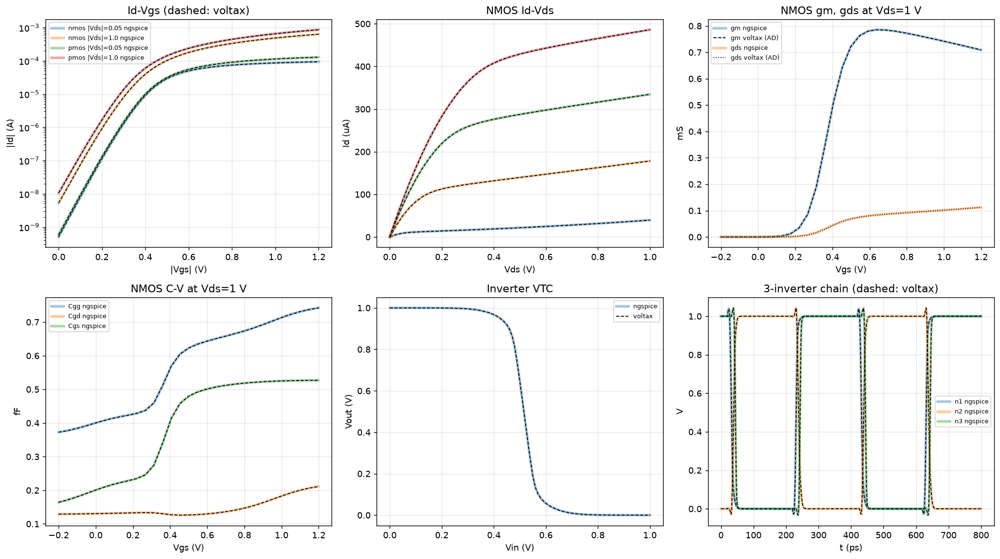
  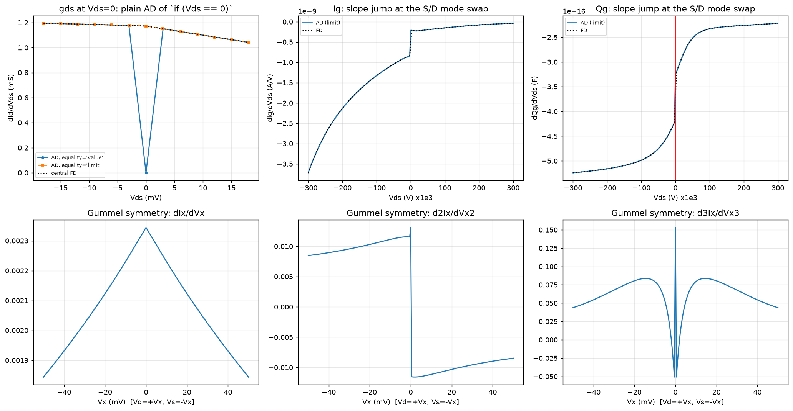
  <br><sub><b>Top:</b> compiled BSIM4 against ngspice. <b>Bottom:</b> the audit through V<sub>ds</sub> = 0, with every branch switch located.</sub>
</p>

## How it works

A circuit is one differential-algebraic equation,

$$\frac{d}{dt}\,q(z) + f(z, t) = 0, \qquad z = [\text{node voltages};\ \text{internal unknowns}],$$

assembled from each device group's terminal currents `f` and charges `q`.
DC solves `f = 0`, transient discretizes `dq/dt`, and AC solves
$(G + j\omega C)\tilde z = b$ with $G = \partial f/\partial z$, $C = \partial q/\partial z$.
Every Newton solve $F(z^\*, p) = 0$ is wrapped in a custom VJP whose backward
pass is a single transposed linear solve:

$$\frac{\partial L}{\partial p} = -\lambda^\top \frac{\partial F}{\partial p}, \qquad \left(\frac{\partial F}{\partial z}\right)^{\!\top}\lambda = \frac{\partial L}{\partial z^\*}.$$

No Newton iteration is unrolled or stored. In a transient analysis the
previous state and the time points are inputs of each step, so the adjoint
runs backwards through `lax.scan`. A device only describes its own physics:

```python
class Memristor(vx.Element):
    terminals = ("p", "n")
    n_internal = 1                                  # the state w
    # fields ron, roff, k: full version in examples/10_custom_element.py

    def currents(self, v, x, t):                    # vectorized over devices
        w = jnp.clip(x[..., 0], 0, 1)
        i = vx.two_terminal(v) / (w * self.ron + (1 - w) * self.roff)
        return vx.through(i), (-self.k * i)[..., None]   # dw/dt = k i

    def charges(self, v, x):
        return None, x
```

## Features

| Area | Included |
|---|---|
| **Analyses** | DC operating point (damped Newton, gmin stepping) · `dc_sweep` with continuation (hysteresis) · transient, backward Euler or trapezoidal · `time_grid` with breakpoint refinement · small-signal AC · `linearize` |
| **Measurements** | `vx.measure`: crossings, delay, period, rise and settling time, energy and power per device, bandwidth, unity-gain frequency, phase and gain margin, all differentiable |
| **Passives and sources** | R, C, L, transformers; V/I sources with differentiable waveforms (pulse, sine, PWL, exp, SFFM, AM, any function); E/G/F/H controlled sources |
| **Semiconductors** | Diode, BJT (Ebers–Moll), EKV MOSFET (charge-conserving), Level 1 with body effect, BSIM4 via Verilog-A, shared process parameters |
| **Behavioral** | Ideal and single-pole op-amps with rails, switches, trainable conductances, nonlinear R/C, B sources |
| **Netlists** | `.subckt` with parameters, `.param`/`.func` expressions, `.include`/`.lib` corners, `.if` blocks, binned `.model`s (ngspice bin rules), `models=` hook for your own devices |
| **Verilog-A** | Partial-evaluation compiler to JAX, NaN-safe branches, `equality="limit"` and smooth modes, differentiability audit |
| **Solvers** | Stamped Jacobians; dense LU, or pure-JAX supernodal sparse LU (nested dissection) above 200 unknowns; adjoint through every solve |
| **Library** | CMOS gates, full and ripple-carry adders, ring oscillators |

## Install

```bash
uv add voltax                       # core: jax, equinox
uv add "voltax[examples]"           # + optax, blackjax, matplotlib, scikit-learn
uv add "jax[cuda12]"                # optional: GPU; Voltax uses whatever JAX finds
```

From source, for the examples or development:

```bash
git clone https://github.com/jaivardhankapoor/voltax && cd voltax
uv sync --all-extras                # .venv from uv.lock
uv run python examples/01_rc_fitting.py
uv run pytest                       # ~3 min on CPU; -m extended adds docs and examples
```

Voltax needs float64 and enables it in JAX on import. On a busy shared CPU,
set `OPENBLAS_NUM_THREADS=1`: thread contention can slow dense solves 100×.
Known limitations: no adaptive time stepping, no noise / pole-zero /
harmonic-balance analyses yet, reverse-mode AD only, and no PSP model yet.

## Citation

```bibtex
@software{kapoor_voltax,
  author = {Kapoor, Jaivardhan},
  title  = {Voltax: differentiable circuit simulation in JAX},
  url    = {https://github.com/jaivardhankapoor/voltax},
  year   = {2026}
}
```

## License

MIT; see [LICENSE](LICENSE). Model cards and the BSIM4 source (downloaded on
demand, not distributed) keep their own licences; see
[`voltax/va/models/NOTICE`](voltax/va/models/NOTICE).
